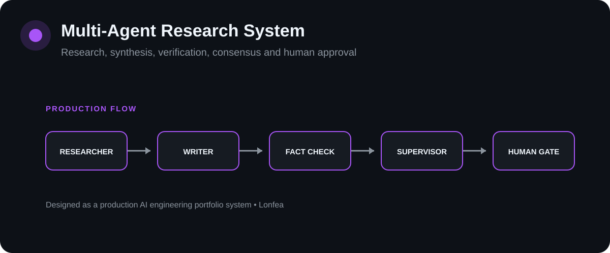

# Multi-Agent Research System

[](https://github.com/Lonfea/multi-agent-research-system/actions/workflows/ci.yml)


<p align="center"></p>

A research workflow where specialized agents gather evidence, draft a report, challenge unsupported claims, reach an explicit consensus decision, and then hand the result to a human reviewer.

## Architecture

```text
flowchart LR
Q[Research topic] --> RES[Researcher]
RES --> W[Writer]
W --> FC[Fact Checker]
FC --> SUP[Supervisor]
SUP --> C{Consensus gate}
C -->|fails| REV[Needs revision]
C -->|passes| H[Human approval]
H -->|approve| DONE[Approved report]
H -->|reject| REV
RES -.-> A[(Audit Trail)]
W -.-> A
FC -.-> A
SUP -.-> A
H -.-> A 
```

## Why this is not just an "agent demo"

Multiple agents do not automatically make an answer correct. This system separates **generation, verification, supervision and human accountability**.

A report can reach human approval only when:
1. the fact-check verification score clears the configured threshold;
2. the supervisor explicitly approves it;
3. no unsupported claims remain.

Every important transition is persisted to an audit trail.

## Agent responsibilities

| Role | Responsibility |
|---|---|
| Researcher | gather relevant evidence and sources |
| Writer | synthesize evidence into a structured report |
| Fact Checker | identify unsupported or inconsistent claims |
| Supervisor | judge whether the evidence/report satisfies release criteria |
| Human Reviewer | final approval/rejection with feedback |

## State flow

```text
stateDiagram-v2
[*] --> Researching
Researching --> Drafting
Drafting --> FactChecking
FactChecking --> Supervising
Supervising --> NeedsRevision: consensus fails
Supervising --> AwaitingHuman: consensus passes
AwaitingHuman --> Approved: human approves
AwaitingHuman --> NeedsRevision: human rejects 
```

## Run locally

```bash
git clone https://github.com/Lonfea/multi-agent-research-system.git
cd multi-agent-research-system
python -m venv .venv
source .venv/bin/activate
pip install -e ".[dev]"
cp .env.example .env
uvicorn app.main:app --reload
```

Credentials used by the current implementation:
- `OPENAI_API_KEY`
- `SERPER_API_KEY`

## API

- **POST `/research`** — start a research run
- **GET `/runs/{run_id}`** — report and audit history
- **POST `/runs/{run_id}/decision`** — human approve/reject decision

## What this demonstrates

CrewAI orchestration, role separation, consensus logic, human approval, persistent auditability, API design and deterministic testing around the non-LLM control plane.

## Next production upgrades

Async job execution, structured source-level citations, failure-specific retries, factuality/source-quality evals and OpenTelemetry traces across agents/tools.
